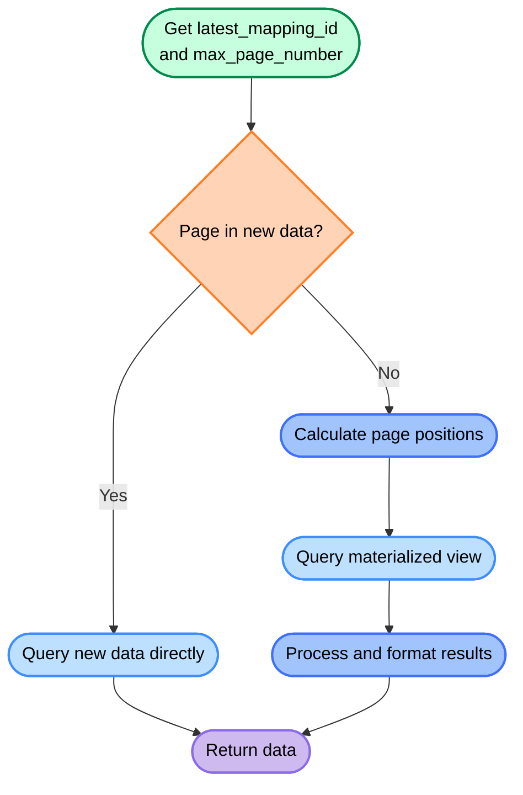

# 🚀 Smart Pagination

## 🌠 Overview

A smart solution for paginating large, constantly changing PostgreSQL datasets using materialized views, solving challenges that traditional pagination methods can't handle effectively.

## ✨ Features

- 🧠 Smart caching system using `big_table_views` for consistent pagination
- ⚡ Efficient handling of new records through intelligent offset calculations

## 🛠️ Getting Started

```bash
# Clone the repository
git clone https://github.com/dongitran/smart-pagination.git

# Navigate to the project directory
cd smart-pagination

# Install dependencies
npm install

# Set up your environment variables
cp .env.sample .env
```

## 🧩 How It Works



The Smart Pagination system:

1. 🔍 Checks if new records exist by comparing with the latest ID in view table
2. 📊 Decides if the page is in new or cached data
3. 🔀 Fetches directly from main table for new data, or from view for cached data
4. 🔢 Handles pages that overlap between new and cached data

## 📜 License

This demo code is licensed under the ISC License.